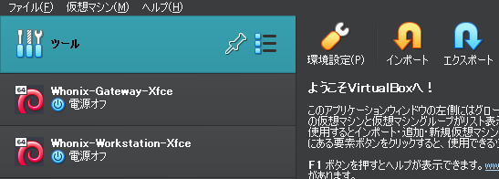
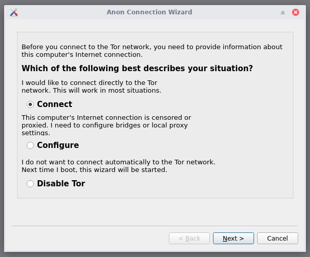
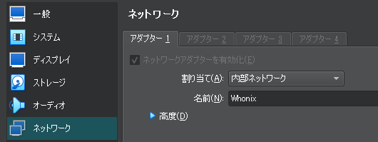

# はじめに

このブログで使用している情報は2024/05/06現在のものです。

時間経過で情報が古くなり仕様変更がある可能性もある為、閲覧の際は注意してください。

# Whonixとは何か？

Whonixは、2012年にTorBOXとしてカナダの[ENCRYPTED SUPPORT LP](https://www.encrypted-support.com)により公開された[Debian](https://www.debian.org/)ベースのLinuxディストリビューションです。

このOSはWhonix-GatewayとWhonix-Workstationという二種類に分かれており、

Gatewayは「PCに接続されているネットワークからTorに接続し、別の端末にアダプタとしてTorネットワークを供給する」という機能、

Workstationは「Gatewayから供給されているTorネットワークのアダプタに接続し、メールやブラウジング等のトラフィックを匿名化する」という機能を持っています。

また、後述する方法を使うと、Kali LinuxやUbuntuなど、Workstation以外のOSでの全通信Tor経由を実現することが可能です。

## 前準備

Whonixを始める際に必要なもの

- Windows、Intelを内蔵したMac、Linuxの内いずれか
  |     | 推奨スペック                           | 最小スペック                       |
  | ----- | ---------------------------------------- | ------------------------------------ |
  | RAM | 8GB以上の空きRAM                       | 1GBの空きRAM                       |
  | ROM | 追加のアプリケーションが追加可能な容量 | 10GBの空き容量                     |
  | CPU | デュアルコア対応のもの                 | AMD-V 又は Intel VT-xを搭載したCPU |
- [VirtualBox](https://www.virtualbox.org/)
- [Whonix-Xfce](https://www.whonix.org/wiki/VirtualBox)

# VirtualBoxのインストール

Whonixを使うにはVirtualBoxという仮想化ソフトウェアが必要になります。

[公式サイト](https://www.virtualbox.org/wiki/Downloads)から最新のVirtualBoxをインストールしてください。

# Whonixのインポート

Whonix-Xfceのダウンロードが完了したら、ダウンロードされたOVAファイルをダブルクリック、又はVirtualBox マネージャーから「インポート」をクリックしダウンロードされたOVAファイルをインポートします。

インポートに完了すると、**Whonix-Gateway-Xfce**と**Whonix-Workstation-Xfce**の二種類が追加されます。

# Whonix-Gatewayの設定

Torネットワークに接続するために、Whonix-Gatewayの起動と設定を行います。

VirtualBoxのメニューからWhonix-Gateway-Xfceを選択し起動します。

しばらく待っているとXfce(デスクトップ環境)と接続前の利用規約が表示されます。

利用規約を読み、二度規約に同意すると、Anon Connection Wizardが起動されます。

Torに接続する場合はConnectを選択し次へ進みます。

Torに接続する前にObfs4などのブリッジを使用したい場合はConfigureを選択して指示に従います。

Torに接続せずに、torrcの設定等を行いたい場合は、Disable Torを選択します。（この場合、Whonixはネットワークに接続されません。）

これにてWhonix-Gatewayの設定完了です。

## torrcを編集する場合（上級者向け）

torrcを編集する場合、`/usr/local/etc/torrc.d/50_user.conf`にあるデータを編集する必要があります。

デスクトップの左上にある端末（Terminal）アプリを開き、

`sudo mousepad /usr/local/etc/torrc.d/50_user.conf`

と打ち込みmousepad（テキストエディタ）をRoot権限で開きtorrcを編集します。

編集が完了したらCtrl + Sを押してセーブしてからmousepadを終了してください。

次にスタートメニューのSystemからAnon Connection Wizardを開き、Connectを選択してTorネットワークに接続します。

これにてtorrcの適用完了です。

# Whonix-Workstationの設定

次に、Torネットワークを使ってネットワーキングするために、Whonix-Workstationの起動と設定を行います。

Whonix-Gatewayを起動したまま、VirtualBoxからWhonix-Workstationを起動してください。

（当たり前ですが、この時Whonix-Gatewayを閉じるとWorkstation側でインターネットに接続できなくなります。）

しばらく待っているとGatewayと同様、Xfce(デスクトップ環境)と接続前の利用規約が表示されるので、参照後同意して進みましょう。

以上でWorkstationの起動後の準備が終わり、無事Torネットワークを使いブラウジング出来るようになりました。

しかしこの状態だとまだ安全で安心とは言えないので設定を行います。

（Torを試してみたいだけ！という人はここで終わっても問題はありません。）

## キーボードレイアウトの変更

キーボードレイアウトをUS配列から日本語配列に変更するために、左上のスタートメニューから、

`Settings`→`Keyboard`→`Layout`と行き、`Use System Defaults`を無効にします。

するとキーボードレイアウトにUS配列以外を使えるようになるので、下にある`Add`から`Japanese`を選択し追加します。

そうするとEnglish(US)の下にJapaneseが来るので、English(US)を削除します。

これにて日本語入力が可能になりました。

## システム言語の変更

英語力のある人なら問題はありませんが、少しでも使いやすくするためにシステム言語を日本語にするにはターミナルを開き、下記のコマンドを入力します。

`sudo dpkg-reconfigure locales`

すると言語設定画面が出現するので、キーボードの十字キーを使い下にスクロールし、`en_US.UTF-8 UTF-8`の選択をスペースキーを使って解除し、`ja_JP.UTF-8 UTF-8`をスペースキーを使い選択してください。

選択が完了したらエンターキーで確定して、`ja_JP.UTF-8 UTF-8`を選択しスペースキーを押してください。

すると日本語の言語ファイルが生成されるので一旦ログアウト（又はシャットダウン）して再ログインしてください。

## 日本語フォントの導入

日本語化したWhonixには日本語フォントが導入されていないため、日本語として表示されるはずの文字が文字化けしてしまいます。

文字化けを解消するために、日本語フォントパッケージをインストールします。

まず、ターミナルを開き、以下のコマンドを入力して、パッケージ一覧のアップデートとシステムの更新を行います。

`sudo apt update && sudo apt full-upgrade`

そして次に日本語フォントをインストールするために、以下のコマンドを入力してください。

`sudo apt install --no-install-recommends fonts-ipaexfont`

インストールが完了したら、一度ログアウトして再ログインすることで日本語フォントが適用されています。

これによって日本語化が完了しました。

### ターミナルの文字が等幅（monospace）になってしまうことへの対処法

日本語フォントを導入して再起動するとターミナルに等幅フォントが適用されており、見た目がとても酷いことになってしまっています。

解消するにはターミナルの編集から`設定`→`外観`からフォントを`DejaVu Sans Mono Book`に変更してください。

## 日本語入力（Fcitx-mozc）の導入

次に、日本語入力（Fcitx-mozc）をインストールするために、以下のコマンドを入力してください。

`sudo apt install fcitx-mozc`

インストールが完了したら、一度再ログインし、スタートメニューから`設定`→`Fcitx 設定`を開き、キーボード-英語(US)を削除してください。

これにより日本語入力が可能になりました。

## パスワードの変更

Whonixを使うにあたり、ホストマシンでは行わないであろう様々なウェブサイトの閲覧や、情報の送信が想定されます。

セキュリティを向上させるためにも、GatewayとWorkstationのパスワードの変更は行いましょう。

パスワードを変更するにはターミナルを開いて、以下のコマンドを入力してください。

`sudo passwd user`

すると、パスワードを要求されるので、ユーザーのデフォルトパスワードである`changeme`を入力して、

その後自身で決めたパスワードを入力することでパスワードが変更することができます。

これにてWhonix-Workstationの設定完了です。安心してブラウジングが可能になりました。

# Whonix-Workstation以外のOSでTorネットワークに接続する方法

Whonixは[Kicksecure](https://www.kicksecure.com/)という、Whonix同様ENCRYPTED SUPPORT LPが作った、Debianをベースとした安全性の高いOSを使っていますが、

このOSは**VPN接続が不可能**だったり**デフォルトで使用可能なアプリケーションが少ない**という欠点があります。

しかし、Whonix-Workstation以外のOSでもTorネットワークに接続する方法があるため、侵入テストツールに強い[Kali Linux](https://www.kali.org/)や、ユーザーフレンドリーな[Ubuntu](https://ubuntu.com/)などを使う方法を解説します。

まず、使いたいOSのイメージを公式のサイトからダウンロードし、VirtualBoxに新規追加、又はインポートします。

そして仮想マシンを起動し、セットアップが完了したら一度シャットダウンします。（もし公式がVirtualBox用のイメージを用意していた場合、この過程は不必要です。）

次に、VirtualBoxの仮想マシンを選択し、設定を開いて`ネットワーク`に移動し、アダプター1の割り当てを`内部ネットワーク`、名前を`Whonix`に変更します。

仮想マシンを起動し、OSのネットワーク設定へ移動し、IPv4の設定を以下のようにしてください。

| **アドレス**     | 10.152.152.XXX(XXXの中身は自由) |
| ------------------ | --------------------------------- |
| **ネットマスク** | **255.255.192.0**               |
| **ゲートウェイ** | **10.152.152.10**               |
| **DNSサーバー**  | **10.152.152.10**               |

こうすることにより、Workstation以外のTorネットワーク接続が可能になります。

## Tor Browserを使わないでOnionサイトを閲覧する方法

Workstationに搭載されているTor Browserは、ブラウザ側でTorへの接続を確立せずに、Gatewayで確立されている接続での通信を行う特別仕様になっていますが、他のOSを使ってしまうと話が違くなり、通常通りの使い方をしてしまうと、Tor Over Tor状態になり、回線が混雑してしまう原因となります。

よって、次の方法を使ってTor Browser以外のブラウザ(例：Firefox, Mullvad Browser)でOnionサイトを閲覧する方法がおすすめです。

（この解説ではMullvad Browserを使用します。）

まずブラウザを開き、URLバーに`about:config`と入力します。

そうするとブラウザのコンフィグ画面に移行することが出来るので、ここでブラウザが.onionドメインの名前解決を行うように

`network.dns.blockDotOnion`という項目をTrueからFalseに変更します。

これにてブラウザが無事にOnionサイトへ進めるようになりました。

# 最後に
Torネットワークは貴方のプライバシーを保護し、言論の自由を保護してくれる便利なものですが、決して成りすましなどの他人に迷惑をかける行為、恐喝やハッキングなどの犯罪行為などに利用してはいけません。
正しい使用用途で使いましょう

???: ネットの中だからって、何でもやっていいと思ったら、大間違いだ！

解説が長々となってしまいましたが、これで締めさせてもらいます。