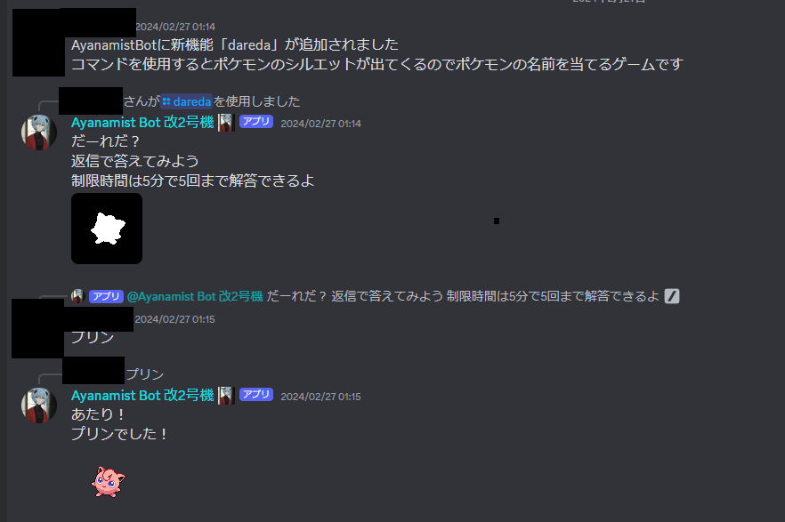

突然ですが、illusionのDiscordにはAyanamist Botという専用のボットがいます。

皆さんはAyanamist Botにどんな機能があるか知っていますか？この記事では機能の一つ、「daredaコマンド」を紹介していきます！

# そもそもコマンドとは？

ここでいうコマンドとはDiscordで[2021年ごろから実装されたスラッシュコマンド](https://discord.com/blog/slash-commands-are-here)のことです。Discord上で`/`と入力してみてください！色々でてきましたよね？~~出てこない……？権限を見直してみましょう。~~ それがスラッシュコマンドです。

# daredaコマンド

スラッシュコマンドの使い方を覚えたところで本題のdaredaコマンドを紹介します。

daredaコマンドは**ポケモンのシルエットクイズ**が遊べるコマンドです。

↓まず実際に使用したときのイメージです。[^1]

daredaコマンドを実行するとボットからポケモンの画像をシルエット化した白黒の画像が送られてきます。

このシルエットのもとのポケモンを当てるゲームです。画像のメッセージへ返信して答えましょう！

ポケモンは初代から最新作まで**1000種類超**の中から出題されます！制限時間は**5分**で**5回**まで解答することができます。

遊び方としてはこれだけですが、何回でも遊べますね。

# まとめ

いかがでしたか？

ポケモンのシルエットクイズ、フレンドと一緒に挑戦してみるのも面白いかもしれません。もしかしたら近い内にスコアやランキング機能なども追加されるかも……？

[^1]: noticeチャンネルから抜粋したメッセージではありますが、一応ユーザーの部分は隠しています。これはシルエットクイズではありません
